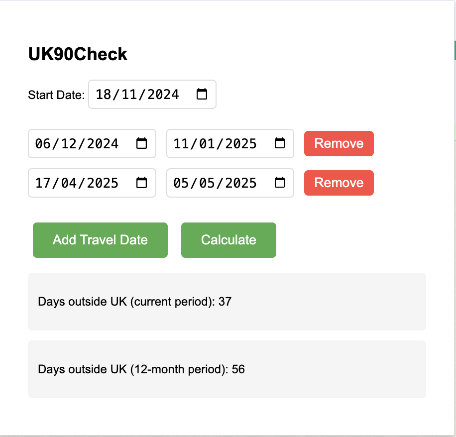

# UK90Check Chrome Extension

A Chrome extension to help track days spent outside the UK in preparation for UK citizenship application.

## Overview

This extension helps you track your days spent outside the UK in preparation for your UK citizenship application. According to UK citizenship rules, you cannot be outside the UK for more than 90 days in the 12 months preceding your citizenship application. The 12-month period can begin after you receive your Indefinite Leave to Remain (ILR).

This is my pilot project to explore AI-generated code using [Cursor](https://www.cursor.com/).

## Features

- Track start date of your 12-month period
- Add and remove travel dates
- Automatic calculation of days spent outside the UK
- Display of both current period and full 12-month period calculations
- Data persistence using Chrome's local storage

## Screenshot

## How to Use (Work in Progress)

This extension is currently under development and not yet available in the Chrome Web Store. Once published, you will be able to:

1. Install the extension from the Chrome Web Store
2. Click the extension icon to open the popup
3. Set your start date (when your 12-month period begins)
4. Add your travel dates using the "Add Travel Date" button
5. View your calculated days:
   - Until now: Days outside UK from start date until today
   - Full period: Days outside UK in the complete 12-month period

## License

This project is licensed under the MIT License - see the [LICENSE](LICENSE) file for details.

