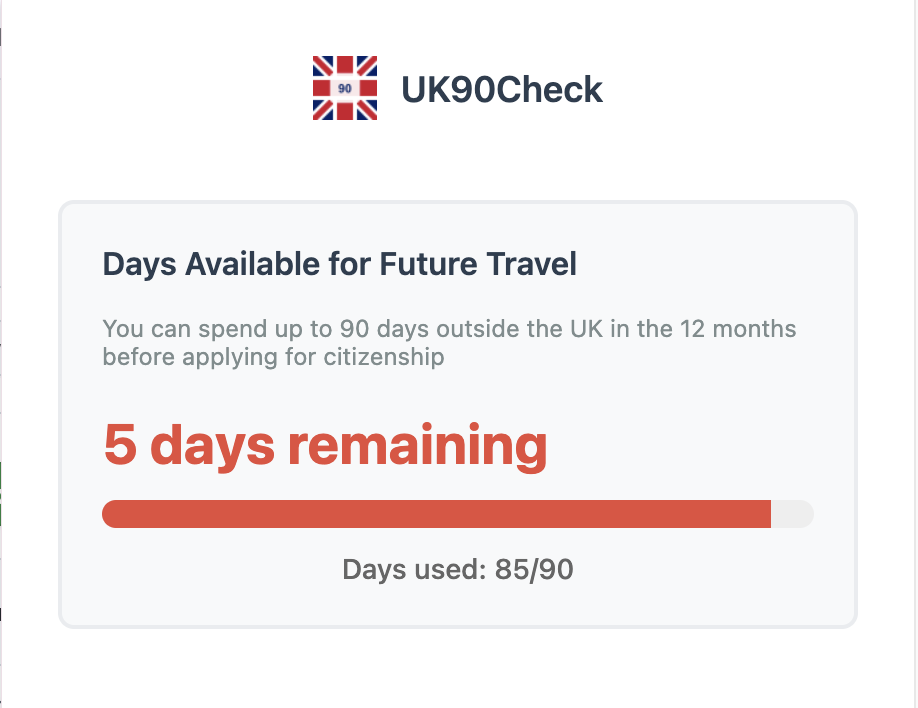
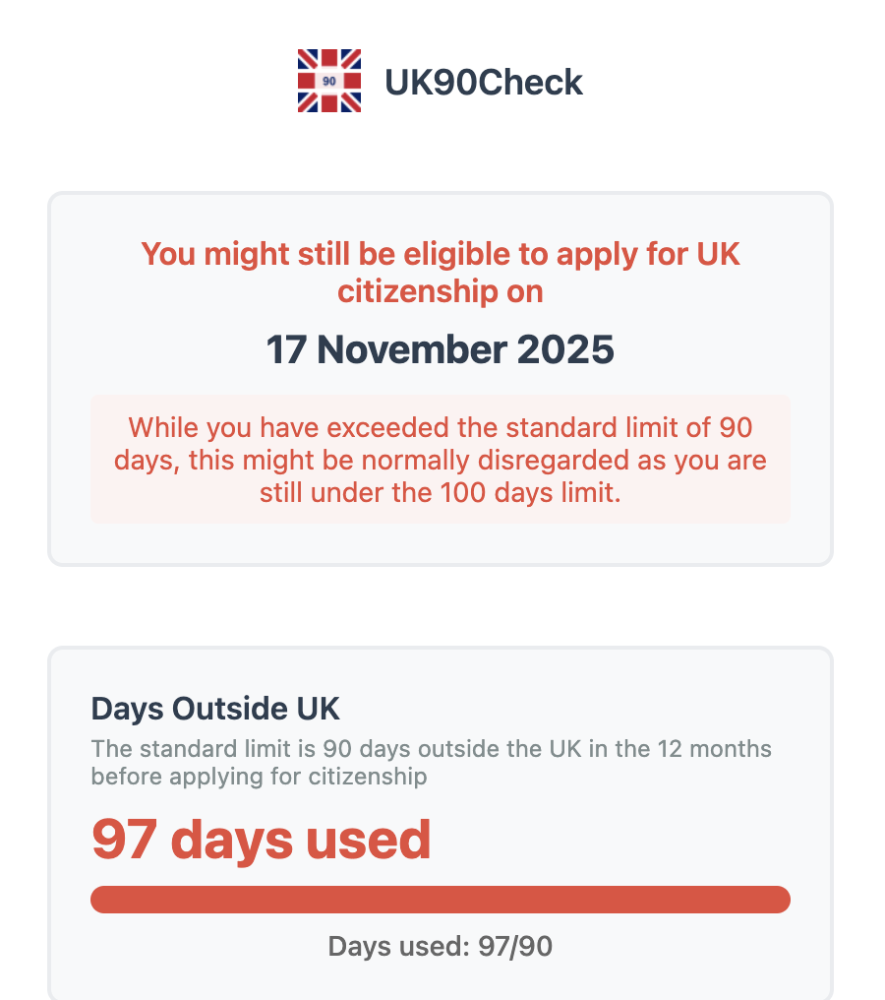
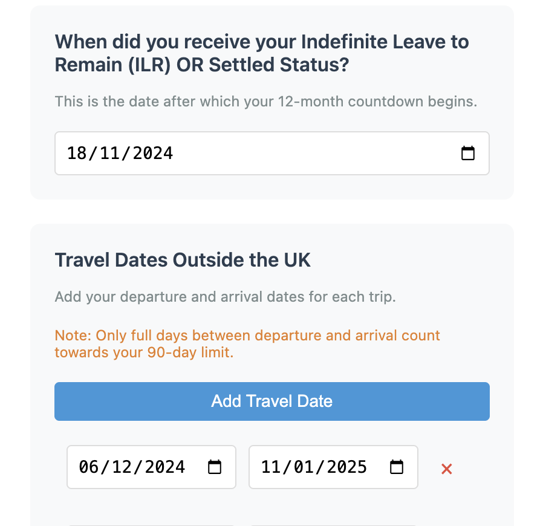

# UK90Check Chrome Extension

A Chrome extension to help track days spent outside the UK in preparation for UK citizenship application.

## Overview

This extension helps you track your days spent outside the UK in preparation for your UK citizenship application. 

According to UK citizenship rules, you cannot be outside the UK for more than 90 days in the 12 months preceding your citizenship application. The 12-month period can begin after you receive your Indefinite Leave to Remain (ILR).

This is my pilot project to explore AI-generated code using [Cursor](https://www.cursor.com/).

## Features

- Track your out of the UK dates before the citizenship application
- Everything is stored locally on your browser and preserved across browser restarts

## Screenshots

  
  
  

## How to Use

Install the chrome extension [here](https://chromewebstore.google.com/detail/fadnfhclnkcpgapnjjglabljimgciodj?utm_source=item-share-cb).

## Support UK90Check ❤️

If this extension has helped you, consider supporting its development with any amount, even small contributions help! 

## License

This project is licensed under the MIT License - see the [LICENSE](LICENSE) file for details.

