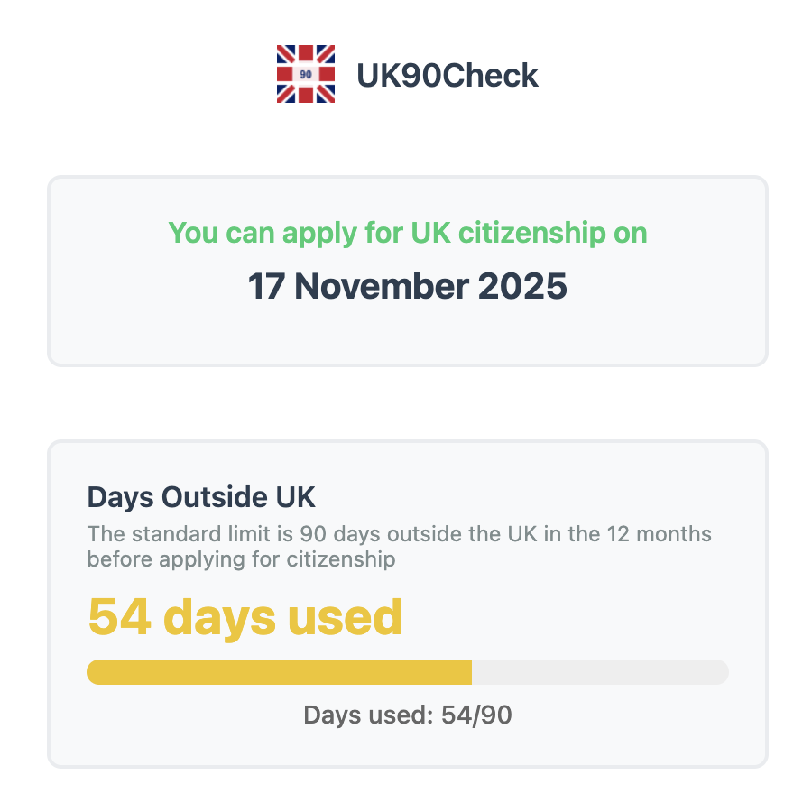

# UK90Check Chrome Extension

A Chrome extension to help track days spent outside the UK in preparation for UK citizenship application.

## Overview

This extension helps you track your days spent outside the UK in preparation for your UK citizenship application. 

According to UK citizenship rules, you cannot be outside the UK for more than 90 days in the 12 months preceding your citizenship application. The 12-month period can begin after you receive your Indefinite Leave to Remain (ILR).

This is my pilot project to explore AI-generated code using [Cursor](https://www.cursor.com/).

## Features

- Track your out of the UK dates before the citizenship application
- Everything is stored locally on your browser and preserved across browser restarts

## Screenshots

## How to Use (Work in Progress)

This extension is currently under development and not yet available in the Chrome Web Store. Once published, you will be able to install the extension from the Chrome Web Store.

## License

This project is licensed under the MIT License - see the [LICENSE](LICENSE) file for details.

